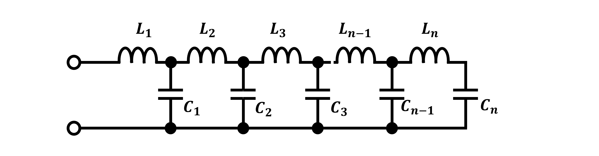
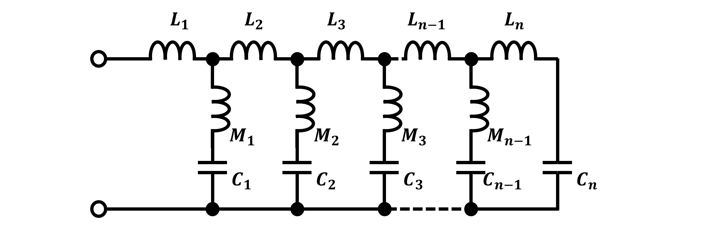
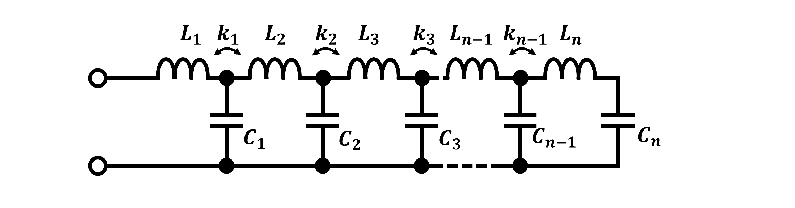

# PFNDesign
PFN(pulse-forming network) Design using matlab

## 支持的PFN类型
最初脉冲产生技术来源于传输线，当需要产生比较宽的脉冲时，传输线尺寸非常大，所以人们想到了使用集总参数的电容和电感代替传输线功能构建脉冲信号，这种方法就被称为脉冲成型网络PFN，其背后的基本原理在于，脉冲包含许多可以使用傅立叶分析定义的频率分量。 这些分量/谐波可以由单独的$LC$电路元件生成并组合起来以有效地“构建”脉冲。 PFN 的组件或级数越多，PFN就越能近似真正的方波脉冲。

下图展示了具体构建过程：

方波可以由一系列的正弦波叠加来表示。但是从上述叠加过程可以看到使用傅里叶级数展开理想方波会出现明显的吉布斯效应，所以为了减小吉布斯效应所带来的过冲线性，Guillemin提出了使用抛物线边沿构造连续脉冲的方法，解决了吉布斯效应从而让PFN电路应用到实际成了可能，并且器件值的收敛速度以$1/n^3$速度收敛，所以5级基本上在应用中已经足够。以下是使用Guillemin线所构建的脉冲示意图：

按照此方法重新计算得到傅里叶系数$^{[1]}$：
$$
\begin{align}
a_{k}=\dfrac{4}{k \pi}\left[\frac{\sin \left(k \dfrac{\pi}{2} \dfrac{\epsilon}{\delta}\right)}{\left(k \dfrac{\pi}{2} \dfrac{\epsilon}{\delta}\right)}\right]^2 \notag{}
\end{align}
$$
得到如下六种PFN电路：

PFN Type A:\

PFN Type B:\

PFN Type C:\

PFN Type D:\

PFN Type E:\

PFN Type F:\

这六种电路要数Type C的参数计算最简单，Type D参数计算最复杂，当然Type D从电路结构上最容易制造，结构也非常简单，详细计算方法见$^{[1]}$。

这里给出Matlab计算代码，有兴趣研究的朋友可以拿去参考$^{[3]}$。

## 设计举例
输入PFN网络最高阶数$n=13$(也就是7级)，并且给出上升时间$\epsilon=0.08s$，总时间是$\delta=1s$，则可以得到各种不同网络的参数：

设计的脉冲波形图如下：

## 参考
[1] :  Ernst A. Guillemin, US2,461,321, PRODUCTION OF ELECTRIC PULSES, 1943.\
[2] : [维基百科](https://en.wikipedia.org/wiki/Pulse-forming_network) \
[3] : [github Matlab计算代码](https://github.com/etools361/PFNDesign) \
[4] : [脉冲成型网络PFN设计](https://mp.weixin.qq.com/s/ukXILPYjwiY7QyBQxBeYVw)

